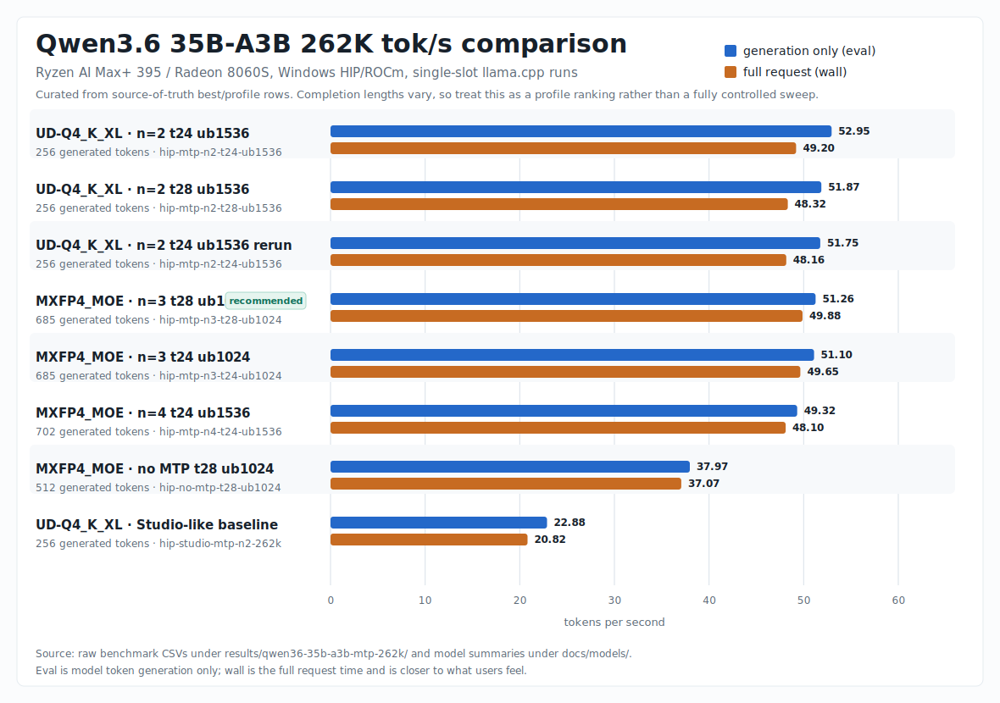

# Ryzen AI Max+ 395 Local LLM Optimizations



In the chart, `eval` means model generation speed only, while `wall` means full request speed and is closer to what a user feels. Chart source rows are in `docs/assets/qwen36-262k-tok-s.csv`. Completion lengths vary across the selected source-of-truth runs, so read it as a profile ranking rather than a fully controlled sweep.

Benchmarks and launch profiles for running large GGUF models on AMD Ryzen AI Max+ 395 / Radeon 8060S Strix Halo systems.

The tuned targets are:

- Recommended model: `Qwen3.6-35B-A3B-MXFP4_MOE.gguf`
- Previous baseline model: `Qwen3.6-35B-A3B-UD-Q4_K_XL.gguf`
- Repo family: `unsloth/Qwen3.6-35B-A3B-MTP-GGUF`
- Context target: `262144`
- Runtime: Unsloth llama.cpp b9704, Windows HIP/ROCm

## For AI Agents

If you are an AI agent helping with this repo, treat these files as the operational source of truth:

- Model-specific summary: `docs/models/qwen3.6-35b-a3b-mtp-ud-q4_k_xl.md`
- MXFP4_MOE summary: `docs/models/qwen3.6-35b-a3b-mtp-mxfp4_moe.md`
- Hermes integration: `docs/integrations/hermes-desktop.md`
- Script layout and local model paths: `scripts/README.md`
- Tuned server launcher: `scripts/localai/qwen36-35b-a3b-mtp-gguf/start-qwen36-35b-a3b-mtp-262k.ps1`
- Double-click launcher: `scripts/localai/qwen36-35b-a3b-mtp-gguf/start-qwen36-35b-a3b-mtp-262k.bat`
- MXFP4_MOE tuned server launcher: `scripts/localai/qwen36-35b-a3b-mtp-gguf/start-qwen36-35b-a3b-mxfp4-mtp-262k.ps1`
- MXFP4_MOE double-click launcher: `scripts/localai/qwen36-35b-a3b-mtp-gguf/start-qwen36-35b-a3b-mxfp4-mtp-262k.bat`
- Benchmark harness: `scripts/localai/qwen36-35b-a3b-mtp-gguf/bench-qwen36-mtp.ps1`
- Ornith Q5_K_M scripts: `scripts/localai/ornith-1.0-35b-gguf/`
- Raw benchmark CSVs: `results/qwen36-35b-a3b-mtp-262k/`

Important behavior:

- Hermes needs a stable OpenAI-compatible endpoint. This repo standardizes on `http://127.0.0.1:8001/v1`.
- Unsloth Studio may launch the same model on a dynamic port such as `53477`; do not assume Hermes is using Studio unless Hermes' `model.base_url` points to that exact live port.
- For Hermes, prefer the `.bat` launcher because it starts the tuned server on the stable `8001` endpoint.
- For `MXFP4_MOE`, use `scripts/localai/qwen36-35b-a3b-mtp-gguf/start-qwen36-35b-a3b-mxfp4-mtp-262k.bat`; it auto-searches `Downloads` and the Unsloth HF cache for `Qwen3.6-35B-A3B-MXFP4_MOE.gguf`.
- `scripts/hermes/add-hermes-qwen-custom-provider.*` only adds the model to Hermes' saved custom providers; it does not switch the active default.
- `scripts/hermes/configure-hermes-qwen-local-provider.*` changes Hermes' active default model to the local endpoint and backs up `%LOCALAPPDATA%\hermes\config.yaml`.
- Do not apply `--spec-type draft-mtp` to arbitrary GGUFs unless the model has an embedded MTP head or a separate compatible draft model.
- Do not replace f16 KV with q8/q4 KV for this specific Qwen profile unless a new 262K benchmark proves it is faster.

## Best Known 262K Profiles

Use this profile for `Qwen3.6-35B-A3B-MXFP4_MOE.gguf` on this hardware:

```powershell
-c 262144 `
--spec-type draft-mtp `
--spec-draft-n-max 3 `
--cache-type-k f16 --cache-type-v f16 `
--spec-draft-type-k f16 --spec-draft-type-v f16 `
-b 2048 -ub 1024 `
-t 28 -tb 28 `
--poll 100 --poll-batch 1 `
--no-mmap `
-ngl 999 `
--flash-attn on `
--no-context-shift `
--parallel 1
```

Measured on the local machine, this reached `51.26 eval tok/s` and `49.88 wall tok/s` on a longer confirmation run at 262K context. Shorter runs peaked at `55.29 eval tok/s` and `51.37 wall tok/s`.

For `Qwen3.6-35B-A3B-UD-Q4_K_XL.gguf`, keep the previous profile:

```powershell
--spec-draft-n-max 2 `
-b 2048 -ub 1536 `
-t 24 -tb 24
```

The original `UD-Q4_K_XL` profile reached about `51-53 eval tok/s` at 262K context, versus about `22-23 eval tok/s` for the Studio-like baseline.

## Quick Start

Start the tuned MXFP4_MOE Qwen server:

Double-click:

```text
scripts\localai\qwen36-35b-a3b-mtp-gguf\start-qwen36-35b-a3b-mxfp4-mtp-262k.bat
```

PowerShell:

```powershell
powershell -NoProfile -ExecutionPolicy Bypass -File .\scripts\localai\qwen36-35b-a3b-mtp-gguf\start-qwen36-35b-a3b-mxfp4-mtp-262k.ps1
```

Use a specific local GGUF instead of the auto-detected Unsloth cache:

```powershell
powershell -NoProfile -ExecutionPolicy Bypass -File .\scripts\localai\qwen36-35b-a3b-mtp-gguf\start-qwen36-35b-a3b-mxfp4-mtp-262k.ps1 `
  -ModelPath C:\path\to\Qwen3.6-35B-A3B-MXFP4_MOE.gguf
```

Start the older UD-Q4 profile instead:

```text
scripts\localai\qwen36-35b-a3b-mtp-gguf\start-qwen36-35b-a3b-mtp-262k.bat
```

Benchmark the main MXFP4 profile:

```powershell
powershell -NoProfile -ExecutionPolicy Bypass -File .\scripts\localai\qwen36-35b-a3b-mtp-gguf\bench-qwen36-mtp.ps1 `
  -ModelPattern Qwen3.6-35B-A3B-MXFP4_MOE.gguf `
  -Case hip-mtp-n3-t28-ub1024 `
  -Context 262144 `
  -OutCsv .\results\qwen36-35b-a3b-mtp-262k\my-rerun.csv
```

The benchmark harness searches `%USERPROFILE%\Downloads` and the default Hugging Face cache under `%USERPROFILE%\.cache\huggingface\...`. If your GGUF lives somewhere else, pass `-ModelPath C:\path\to\Qwen3.6-35B-A3B-MXFP4_MOE.gguf`.

Download Ornith 1.0 35B Q5_K_M:

```text
scripts\localai\ornith-1.0-35b-gguf\download-ornith-1.0-35b-q5-k-m.bat
```

The Q5_K_M GGUF is about `23.0 GiB`, so check free disk space before starting the download.

Benchmark Ornith with a no-MTP HIP profile:

```powershell
powershell -NoProfile -ExecutionPolicy Bypass -File .\scripts\localai\ornith-1.0-35b-gguf\bench-ornith-1.0-35b-q5-k-m.ps1 `
  -Case hip-no-mtp-t28-ub1024 `
  -Context 262144 `
  -OutCsv .\results\ornith-1.0-35b-gguf\ornith-q5-rerun.csv
```

Ornith is not treated as an MTP model here; retune and prove it before adding `--spec-type draft-mtp`.

## Local Model Storage

This repo keeps model weights out of git. The current local install is mostly Hugging Face cache based:

- Runtime: `%USERPROFILE%\.unsloth\llama.cpp\build\bin\Release\llama-server.exe`
- Qwen cache: `%USERPROFILE%\.cache\huggingface\hub\models--unsloth--Qwen3.6-35B-A3B-MTP-GGUF\snapshots\...`
- Ornith downloader target: `%USERPROFILE%\.cache\huggingface\hub\models--deepreinforce-ai--Ornith-1.0-35B-GGUF\snapshots\...`

Use `-ModelPath` for one-off files elsewhere. Prefer the Hugging Face cache by default because the existing Qwen files already live there and it avoids duplicate 20+ GB GGUFs.

## Hermes Desktop

Hermes Desktop / Hermes Agent can use the tuned llama.cpp server as a local OpenAI-compatible provider.

Start the server, then configure Hermes:

```text
scripts\localai\qwen36-35b-a3b-mtp-gguf\start-qwen36-35b-a3b-mxfp4-mtp-262k.bat
scripts\hermes\add-hermes-qwen-mxfp4-custom-provider.bat
scripts\hermes\configure-hermes-qwen-mxfp4-local-provider.bat
```

Use `scripts\hermes\add-hermes-qwen-mxfp4-custom-provider.bat` to make the endpoint appear under saved custom providers without changing your active default. Use `scripts\hermes\configure-hermes-qwen-mxfp4-local-provider.bat` when you want to switch Hermes' active default model to the local endpoint.

The older generic provider BATs still work for the same endpoint; the MXFP4 BATs only give the saved provider a clearer display name.

The active-default config helper backs up `%LOCALAPPDATA%\hermes\config.yaml` and applies:

```yaml
model:
  provider: custom
  base_url: http://127.0.0.1:8001/v1
  default: local
  context_length: 262144
  api_mode: chat_completions
```

See `docs/integrations/hermes-desktop.md`.

## Repo Layout

- `scripts/README.md`: script layout and local model storage notes.
- `scripts/localai/qwen36-35b-a3b-mtp-gguf/`: Qwen GGUF server launchers and MTP benchmark harness.
- `scripts/localai/ornith-1.0-35b-gguf/`: Ornith Q5_K_M downloader and no-MTP benchmark harness.
- `scripts/hermes/`: Hermes saved-provider and active-default helpers.
- `docs/models/qwen3.6-35b-a3b-mtp-ud-q4_k_xl.md`: model-specific tuning summary and agent notes.
- `docs/models/qwen3.6-35b-a3b-mtp-mxfp4_moe.md`: MXFP4_MOE tuning summary and agent notes.
- `docs/integrations/hermes-desktop.md`: Hermes Desktop local-provider setup.
- `results/qwen36-35b-a3b-mtp-262k/`: raw CSV benchmark results.
- `patches/unsloth-studio-rocm-strix-mtp.patch`: patch record for applying the Studio backend defaults.

## Agent Recipe For Other Local Models

1. Confirm the backend and device:

```powershell
$server = "$HOME\.unsloth\llama.cpp\build\bin\Release\llama-server.exe"
& $server --version
& $server --list-devices
```

2. Confirm the model actually supports embedded MTP before using `--spec-type draft-mtp`. MTP is model-specific; do not blindly apply this to ordinary GGUFs.

3. Start from the Qwen profile when all of these are true:

- AMD Ryzen AI Max+ 395 or similar Strix Halo APU
- Windows HIP/ROCm llama.cpp backend
- Single-slot serving with `--parallel 1`
- Large unified-memory context, especially `-c 262144`
- Qwen/Gemma-style embedded MTP head

4. Tune in this order:

- `--spec-draft-n-max`: try `1..6`; `3` was best for `MXFP4_MOE`, while `2` was best for `UD-Q4_K_XL`.
- Threads: try `16`, `20`, `24`, `28`; `28` was narrowly best for `MXFP4_MOE`, while `24` stayed the safer low-CPU fallback.
- Microbatch: try `512`, `1024`, `1536`, `2048`; `1024` was best for `MXFP4_MOE`, while `1536` was best for `UD-Q4_K_XL`.
- Batch: keep `-b 2048` unless a fresh sweep proves otherwise.
- KV cache: keep f16 for this model/hardware unless memory forces a change.
- Backend: compare HIP and Vulkan locally; Windows Vulkan was slower here.

5. Avoid assuming that a higher acceptance rate means faster output. `--spec-draft-p-min 0.75` raised acceptance but reduced throughput.

6. Watch for slow-path symptoms. If prompt eval drops near `40-70 tok/s` and generation near `20-23 tok/s`, the run is probably in a bad profile or bad runtime state. Recheck KV type, mmap, batch size, backend, and current system memory pressure.

## Known Bad Settings For This Model

At 262K on this machine, these stayed around `20-23 eval tok/s`:

- `q8_0` or `q4_0` KV cache
- mmap enabled
- `ngram-mod,draft-mtp`
- `--spec-draft-p-min 0.75`
- Windows Vulkan b9704
- Studio-like `threads=2`

## Studio Notes

The installed Unsloth Studio backend was patched locally to use the measured Windows ROCm full-offload defaults:

- `--threads 24 --threads-batch 24`
- `--batch-size 2048 --ubatch-size 1536`
- `--poll 100 --poll-batch 1`
- `--no-mmap`

An Unsloth Studio update may overwrite the installed package. Reapply `patches/unsloth-studio-rocm-strix-mtp.patch` or use the standalone launcher script.

For `Qwen3.6-35B-A3B-MXFP4_MOE.gguf`, prefer `scripts/localai/qwen36-35b-a3b-mtp-gguf/start-qwen36-35b-a3b-mxfp4-mtp-262k.bat` unless a fresh Studio benchmark proves Studio is applying the same `n=3`, `ub1024`, f16-KV profile.
