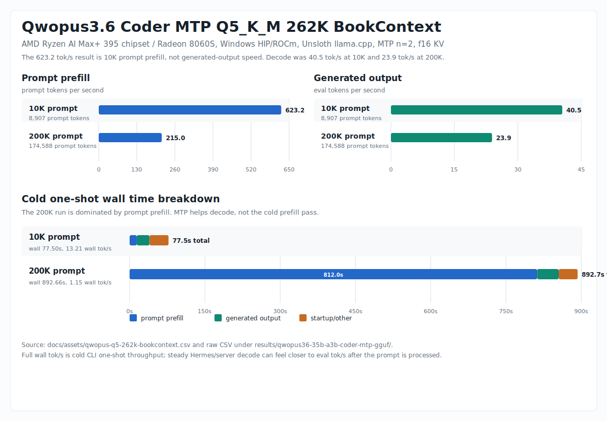

# Qwopus3.6 35B-A3B Coder MTP Q5_K_M

This file is the setup note for `Qwopus3.6-35B-A3B-Coder-MTP-Q5_K_M.gguf` on Ryzen AI Max+ 395 / Radeon 8060S.

## Model

- GGUF: `Qwopus3.6-35B-A3B-Coder-MTP-Q5_K_M.gguf`
- Hugging Face repo: `Jackrong/Qwopus3.6-35B-A3B-Coder-MTP-GGUF`
- Local target: `%USERPROFILE%\.cache\huggingface\hub\models--Jackrong--Qwopus3.6-35B-A3B-Coder-MTP-GGUF\snapshots\manual`
- File size: about `23.60 GiB`
- Base family: Qwopus3.6 / Qwen3.6 35B-A3B sparse MoE
- Focus: thinking-off coding-agent workflows
- Feature used locally: embedded MTP head through llama.cpp `--spec-type draft-mtp`

The model card says the central target is thinking-off execution for coding agents, and the highlighted evaluation quant is Q5_K_M. That is why the local launcher defaults `--reasoning off`.

## Endpoint

Qwopus uses a separate local port from the Qwen profiles:

```text
http://127.0.0.1:8004/v1
```

This lets Hermes keep Qwen and Qwopus as separate saved custom providers:

- Qwen MXFP4 MTP: `http://127.0.0.1:8001/v1`
- Qwopus Coder Q5_K_M MTP: `http://127.0.0.1:8004/v1`

## Install

Double-click:

```text
scripts\localai\qwopus36-35b-a3b-coder-mtp-gguf\install-qwopus36-35b-a3b-coder-mtp-q5-k-m.bat
```

The install script:

1. Downloads the GGUF into the Hugging Face cache.
2. Adds a Hermes saved custom provider named `Qwopus3.6 35B-A3B Coder MTP Q5_K_M 262K`.
3. Leaves the active Hermes default unchanged unless `-ConfigureHermesDefault` is passed to the PowerShell installer.

To make Qwopus the active Hermes default:

```powershell
powershell -NoProfile -ExecutionPolicy Bypass -File .\scripts\localai\qwopus36-35b-a3b-coder-mtp-gguf\install-qwopus36-35b-a3b-coder-mtp-q5-k-m.ps1 -ConfigureHermesDefault
```

## Start Server

Double-click:

```text
scripts\localai\qwopus36-35b-a3b-coder-mtp-gguf\start-qwopus36-35b-a3b-coder-mtp-q5-k-m-262k.bat
```

PowerShell:

```powershell
powershell -NoProfile -ExecutionPolicy Bypass -File .\scripts\localai\qwopus36-35b-a3b-coder-mtp-gguf\start-qwopus36-35b-a3b-coder-mtp-q5-k-m-262k.ps1
```

## Launch Profile

The server launcher defaults to the long-context Qwopus baseline:

```powershell
-c 262144 `
--spec-type draft-mtp `
--spec-draft-n-max 2 `
--cache-type-k f16 --cache-type-v f16 `
--spec-draft-type-k f16 --spec-draft-type-v f16 `
-b 2048 -ub 1024 `
-t 28 -tb 28 `
--poll 100 --poll-batch 1 `
--no-mmap `
-ngl 999 `
--flash-attn on `
--no-context-shift `
--parallel 1 `
--reasoning off
```

`--spec-draft-n-max 2` is the safer default for this Qwopus profile. A short smoke test with `n=3` was faster than no MTP, but the file-prompt fixture run below uses `n=2`, matching the broad MTP recommendation and avoiding overfitting to a tiny prompt.

## Benchmarks

One quick 262K check was run after install, using the same short benchmark prompt as the Qwen harness and 512 generated tokens:

| Case | Eval tok/s | Wall tok/s | Prompt tok/s | Draft acceptance |
| --- | ---: | ---: | ---: | ---: |
| `draft-mtp n=3, t28, ub1024` | 37.94 | 36.54 | 128.18 | 0.6928 |
| `no MTP, t28, ub1024` | 26.31 | 25.77 | 159.01 | 0.0000 |

MTP improved wall throughput by about 42% on this prompt. Qwopus Q5_K_M is slower than the local Qwen MXFP4 profile, but it is a coder fine-tune and should be evaluated on coding-agent quality as well as raw tok/s.

The meaningful long-context run uses the copied NVIDIA-local-LLM-profiles book fixtures at `262144` context and `1024` requested generated tokens:



| Prompt fixture | Prompt tokens | Prompt eval tok/s | Generation tok/s | Full wall tok/s | Wall time |
| --- | ---: | ---: | ---: | ---: | ---: |
| `book-context-10k.txt` | 8,907 | 623.2 | 40.5 | 13.21 | 77.50s |
| `book-context-200k.txt` | 174,588 | 215.0 | 23.9 | 1.15 | 892.66s |

Result CSV:

```text
results\qwopus36-35b-a3b-coder-mtp-gguf\qwopus-q5-cli-ctx262k-book-10k-200k-gen1024-mtp-n2-20260630-101249.csv
```

Conclusion: MTP helps decoding, but it does not solve cold 200K prompt prefill. At 174K prompt tokens, full one-shot wall speed is dominated by loading/prefill even though generation after the deep context still reaches `23.9 tok/s`.

Retune later if throughput or acceptance looks weak. The first things to try would be `threads=24`, `ubatch=1536`, and `--spec-draft-n-max 3` on the same 10K/200K fixtures, because short prompts alone are not representative.

To rerun the file-prompt benchmark:

```text
scripts\localai\qwopus36-35b-a3b-coder-mtp-gguf\bench-qwopus36-10k-200k-mtp-n2.bat
```

The benchmark uses `llama-cli.exe` for prompt files. If `%USERPROFILE%\.unsloth\llama.cpp\build\bin\Release\llama-cli.exe` is missing, build the small launcher first:

```text
scripts\localai\tools\build-llama-cli-launcher.bat
```

## Hermes

Add saved provider only:

```text
scripts\hermes\add-hermes-qwopus-coder-custom-provider.bat
```

Switch active default:

```text
scripts\hermes\configure-hermes-qwopus-coder-local-provider.bat
```

Verify after the server is running:

```powershell
Invoke-RestMethod http://127.0.0.1:8004/v1/models
```

## Agent Notes

1. This is an MTP GGUF. Keep `--spec-type draft-mtp` enabled unless a local benchmark proves otherwise.
2. The default provider uses port `8004` to avoid renaming or clobbering the existing Qwen provider on port `8001`.
3. Hermes sees only an OpenAI-compatible endpoint; start the Qwopus server before selecting the Qwopus provider.
4. The model card emphasizes thinking-off coding-agent use, so do not enable reasoning by default for Hermes.
5. Do not judge 200K-context usability from a 512-token smoke test. Use the 10K/200K book fixtures when changing MTP draft count, batch, ubatch, or KV settings.
